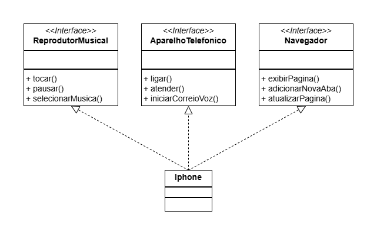

# DIO - Trilha POO Java

        <picture>
                <source media="(prefers-color-scheme: light)" srcset="https://img.shields.io/badge/Java-black?style=for-the-badge&logo=OpenJDK&logoColor=white">
                
        </picture>
        <picture>
                <source media="(prefers-color-scheme: light)" srcset="https://img.shields.io/badge/Maven-black?style=for-the-badge&logo=ApacheMaven&logoColor=white">
                
        </picture>
        <picture>
                <source media="(prefers-color-scheme: light)" srcset="https://img.shields.io/badge/Spring_Boot-black?style=for-the-badge&logo=SpringBoot&logoColor=white">
                
        </picture>
        <picture>
                <source media="(prefers-color-scheme: light)" srcset="https://img.shields.io/badge/UML-black?style=for-the-badge&logo=UML&logoColor=white">
                
        </picture>

## Autor do Desafio e Repositório Original
- [Gleyson Sampaio](https://github.com/glysns)
- [Desafio Diagramação de Classes do Iphone](https://github.com/digitalinnovationone/trilha-java-basico/tree/main/desafios/poo)

## Contexto
O desafio é diagramar e modelar um Iphone em `UML` e `código` baseado-se no vídeo do [lançamento do primeiro Iphone](https://www.youtube.com/watch?v=9ou608QQRq8), onde Steve Jobs anuncia que o Iphone seria a junção de um reprodutor musical, um aparelho telefônico e um dispositivo de comunicação com a internet (navegador).

Utilize conceitos de POO para diagramar com a ferramenta de sua preferência e criar as interfaces que representam as seguintes funções:

- `Reprodutor Musical`: tocar, pausar, selecionarMusica
- `Aparelho Telefônico`: ligar, atender, iniciarCorreioVoz
- `Navegador`: exibirPagina, adicionarNovaAba, atualizarPagina

Além de diagramar e criar a classe que representa o Iphone em si.

## Diagrama UML
Abaixo temos o diagrama UML que representa o Iphone herdando as características apresentadas:

        

